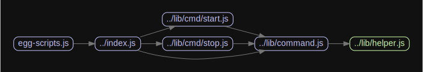

# 源码分析

提供start/stop命令。
start命令基于framework的startCluster方法，sotp则是挨个杀掉子进程。

## 文件结构

``` bash
/Users/liufang/openSource/FunnyLiu/egg-scripts
├── bin
|  └── egg-scripts.js - 直接使用index.js的start()
├── graphviz
├── index.js - 命令入口，继承自lib/command.js，注册lib/cmd下所有命令
├── lib
|  ├── cmd
|  |  ├── start.js -注册start命令，继承自lib/command.js。执行lib/start-cluster中的bin命令
|  |  └── stop.js - 注册stop命令，继承自lib/command.js
|  ├── command.js - 继承自common-bin模块，将lib/helper.js合并到this.helper
|  ├── helper.js - 提供kill、findNodeProcess方法
|  └── start-cluster - 调用framework的startCluster方法
```

## 外部模块依赖

请在： http://npm.broofa.com?q=egg-scripts 查看

核心外部依赖：

- [common-bin源码分析](https://github.com/FunnyLiu/common-bin/tree/readsource)


## 内部模块依赖


  

## 逐个文件分析

### index.js

继承自lib/command.js，load加载lib/cmd下所有命令。

### lib/command.js

继承自common-bin模块，初始化logger，复写了context。
将lib/helper.js合并到this.helper上。

### lib/helper.js

提供kill方法，批量杀子进程；
提供findNodeProcess方法，寻找子进程。

### lib/cmd/start.js

注册start命令。继承自lib/command.js。

整理各种参数和环境变量，执行lib/start-cluster中的bin命令。


### lib/cmd/stop.js

注册stop命令，继承自lib/command.js。

基于helper.js提供的findNodeProcess和kill方法，挨个杀掉子进程。

# egg-scripts

deploy tool for egg project.

**Note: Windows is partially supported, see [#22](https://github.com/eggjs/egg-scripts/pull/22)**


---

## Install

```bash
$ npm i egg-scripts --save
```

## Usage

Add `eggctl` to `package.json` scripts:

```json
{
  "scripts": {
    "start": "eggctl start --daemon",
    "stop": "eggctl stop"
  }
}
```

Then run as:

- `npm start`
- `npm stop`

**Note:** `egg-scripts` is not recommended to install global, you should install and use it as npm scripts.

## Command

### start

Start egg at prod mode.

```bash
$ eggctl start [options] [baseDir]
# Usage
# eggctl start --port=7001
# eggctl start ./server
```

- **Arguments**
  - `baseDir` - directory of application, default to `process.cwd()`.
- **Options**
  - `port` - listening port, default to `process.env.PORT`, if unset, egg will use `7001` as default.
  - `title` - process title description, use for kill grep, default to `egg-server-${APP_NAME}`.
  - `workers` - numbers of app workers, default to `process.env.EGG_WORKERS`, if unset, egg will use `os.cpus().length`  as default.
  - `daemon` - whether run at background daemon mode, don't use it if in docker mode.
  - `framework` - specify framework that can be absolute path or npm package, default to auto detect.
  - `env` - server env, default to `process.env.EGG_SERVER_ENV`, recommended to keep empty then use framwork default env.
  - `stdout` - customize stdout file, default to `$HOME/logs/master-stdout.log`.
  - `stderr` - customize stderr file, default to `$HOME/logs/master-stderr.log`.
  - `timeout` - the maximum timeout when app starts, default to 300s.
  - `ignore-stderr` - whether ignore stderr when app starts.
  - `sourcemap` / `typescript` / `ts` - provides source map support for stack traces.
  - `node` - customize node command path, default will find node from $PATH

### stop

Stop egg gracefull.

**Note:** if exec without `--title`, it will kill all egg process.

```bash
# stop egg
$ eggctl stop [--title=example]
```

- **Options**
  - `title` - process title description, use for kill grep.

## Questions & Suggestions

Please open an issue [here](https://github.com/eggjs/egg/issues?q=is%3Aissue+is%3Aopen+sort%3Aupdated-desc).

## License

[MIT](LICENSE)

